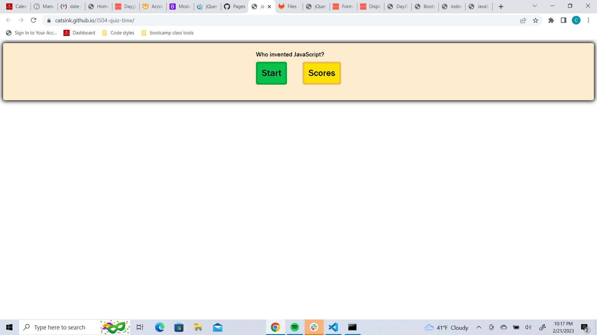

# JS04-QUIZ-TIME

## Description

This project is a chance to review JavaScript concepts and apply them to a timed quiz that keeps track of high scores. Although it has been deployed it is still in progress. I am working on a few bugs and need to improve how I define variables and use functions in JavaScript. I have learned a lot about best practices and what not to do throughout the trials of this assignment.

## Usage

Repository link:<https://github.com/CatSink/JS04-quiz-time/>
Deployed webpage link:<https://catsink.github.io/JS04-quiz-time/>
screenshot: 

To add a screenshot, create an `assets/images` folder in your repository and upload your screenshot to it. Then, using the relative file path, add it to your README using the following syntax:

## License

MIT License

Copyright (c) [2023] [Catherine Sinkowski]

Permission is hereby granted, free of charge, to any person obtaining a copy
of this software and associated documentation files (the "Software"), to deal
in the Software without restriction, including without limitation the rights
to use, copy, modify, merge, publish, distribute, sublicense, and/or sell
copies of the Software, and to permit persons to whom the Software is
furnished to do so, subject to the following conditions:

The above copyright notice and this permission notice shall be included in all
copies or substantial portions of the Software.

THE SOFTWARE IS PROVIDED "AS IS", WITHOUT WARRANTY OF ANY KIND, EXPRESS OR
IMPLIED, INCLUDING BUT NOT LIMITED TO THE WARRANTIES OF MERCHANTABILITY,
FITNESS FOR A PARTICULAR PURPOSE AND NONINFRINGEMENT. IN NO EVENT SHALL THE
AUTHORS OR COPYRIGHT HOLDERS BE LIABLE FOR ANY CLAIM, DAMAGES OR OTHER
LIABILITY, WHETHER IN AN ACTION OF CONTRACT, TORT OR OTHERWISE, ARISING FROM,
OUT OF OR IN CONNECTION WITH THE SOFTWARE OR THE USE OR OTHER DEALINGS IN THE
SOFTWARE.

---
